# Лабораторная работа №1

## Задание 1
```
name = input("Имя: ")
age = int(input("Возраст :"))
age1= age + 1
print(f"Привет, {name}! Через год тебе будет {age1}.") 
```
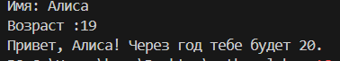


## Задание 2
```
a=float(input("a: ").replace(',','.'))
b=float(input("b: ").replace(',','.'))
sum=a+b
avg=sum/2
print(f"sum={sum:.2f}; avg={avg:.2f}")
```
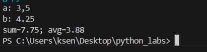


## Задание 3
```
price=float(input())
discount=float(input())
vat=float(input())
base = price * (1 - discount/100)
vat_amount = base * (vat/100)
total = base + vat_amount
print(f"База после скидки: {base:.2f} ₽")
print(f"НДС:  {vat_amount:.2f} ₽")
print(f"Итого к оплате: {total:.2f} ₽")
```
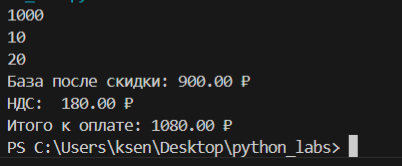


## Задание 4
```
m=int(input("Минуты: "))
hour=m//60
m1=m%60
print(f"{hour}:{m1}")
```
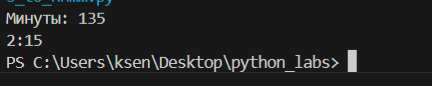


## Задание 5
```
name=input("ФИО: ").strip()
part=name.split()
length=len(''.join(part))+2
ini=''.join([i[0].upper() for i in part])
print(f"Инициалы: {ini}")
print(f"Длина (символов): {length}")
```
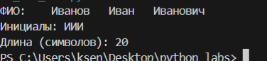


## Задание 6
```
n=int(input())
online=0
offline=0
for i in range(n):
    line=input()
    if 'True' in line:
        online+=1 
    else:
        offline+=1 
print(online,offline)
```
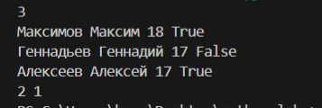

# Лабораторная работа №2

## Задание 1
```
def min_max(nums: list[float | int]) -> tuple[float | int, float | int]:
    if not nums:
        return ValueError
    return (min(nums), max(nums)) 
print(min_max([3, -1, 5, 5, 0]))
print(min_max([42]))
print(min_max([-5, -2, -9]))
print(min_max([]))
print(min_max([1.5, 2, 2.0, -3.1]))

def unique_sorted(nums: list[float | int]) -> list[float | int]:
    unique_nums=list(set(nums))
    unique_nums.sort()
    return unique_nums
print(unique_sorted([3, 1, 2, 1, 3]))
print(unique_sorted([]))
print(unique_sorted([-1, -1, 0, 2, 2]))
print(unique_sorted([1.0, 1, 2.5, 2.5, 0]))

def flatten(mat: list[list | tuple]) -> list:
    res=[]
    for x in mat:
        if not isinstance(x,(list,tuple)):
            raise TypeError(f"строка не строка строк матрицы")
        res.extend(x)
    return res
print(flatten([[1, 2], [3, 4]]))
print(flatten([[1, 2], (3, 4, 5)]))
print(flatten([[1], [], [2, 3]]))
print(flatten([[1, 2], "ab"]))
```
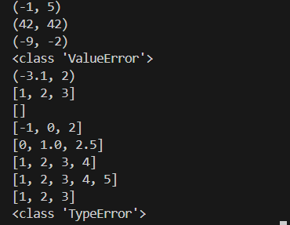

## Задание 2
```
def transpose(mat: list[list[float | int]]) -> list[list]:
    if not mat:
        return []
    row_length = len(mat[0])
    for i, row in enumerate(mat):
        if len(row) != row_length:
            return ValueError
    result = []
    for cl in range(len(mat[0])):
        new_row = []
        for row in range(len(mat)):
            new_row.append(mat[row][cl])
        result.append(new_row)
    return result
print(transpose([[1, 2, 3]]))
print(transpose([[1], [2], [3]]))
print(transpose([[1, 2], [3, 4]]))
print(transpose([]))
print(transpose([[1, 2], [3]]))

def row_sums(mat: list[list[float | int]]) -> list[float]:
    if not mat:
        return []
    row_length = len(mat[0])
    for i, row in enumerate(mat):
        if len(row) != row_length:
            return ValueError
    result = []
    for row in mat:
        result.append(sum(row))
    return result
print(row_sums([[1, 2, 3], [4, 5, 6]]))
print(row_sums([[-1, 1], [10, -10]]))
print(row_sums([[0, 0], [0, 0]]))
print(row_sums([[1, 2], [3]]))

def col_sums(mat: list[list[float | int]]) -> list[float]:
    if not mat:
        return []
    row_length = len(mat[0])
    for i, row in enumerate(mat):
        if len(row) != row_length:
            return ValueError
    result = []
    for col in range(len(mat[0])):
        col_sum = 0
        for row in range(len(mat)):
            col_sum += mat[row][col]
        result.append(col_sum)
    return result
print(col_sums([[1, 2, 3], [4, 5, 6]]))
print(col_sums([[-1, 1], [10, -10]]))
print(col_sums([[0, 0], [0, 0]]))
print(col_sums([[1, 2], [3]]))
```
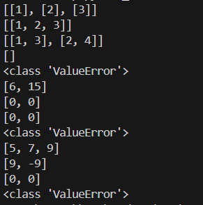

## Задание 3
```
def format_record(rec:tuple[str,str,float])-> str:
    fio,group,gpa=rec
    part_fio=[part.strip() for part in fio.split() if part.strip()]
    ini=[]
    for part in part_fio[1:]:
        if part:
            ini.append(f"{part[0].upper()}.")
    res_fio=f"{part_fio[0]} {''.join(ini)}"
    res_gpa=f"{gpa:.2f}"
    return f"{res_fio}, гр. {group}, GPA {res_gpa}"
print(format_record(("Иванов Иван Иванович", "BIVT-25", 4.6) ))
print(format_record(("Петров Пётр", "IKBO-12", 5.0)))
print(format_record(("Петров Пётр Петрович", "IKBO-12", 5.0)))
print(format_record(("  сидорова  анна   сергеевна ", "ABB-01", 3.999)))
```
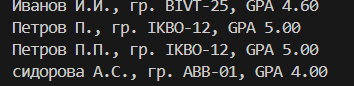

# Лабораторная работа №3

## Задание 1
```
def normalize(text: str, *, casefold: bool = True, yo2e: bool = True) -> str:
    text=text.casefold()
    if yo2e:
        text=text.replace('ё','е').replace('Ё','Е')
    text=text.replace('\t',' ').replace('\r',' ').replace('\n',' ')
    text=' '.join(text.split())
    text=text.strip()
    return text
print(normalize("ПрИвЕт\nМИр\t"))
print(normalize("ёжик, Ёлка"))
print(normalize("Hello\r\nWorld"))
print(normalize("  двойные   пробелы  "))

import re
def tokenize(text: str) -> list[str]:
    return re.findall(r'\w+(?:-\w+)*',text)
print(tokenize("привет мир"))
print(tokenize("hello,world!!!"))
print(tokenize("по-настоящему круто"))
print(tokenize("2025 год"))
print(tokenize("emoji 😀 не слово"))

def count_freq(tokens: list[str]) -> dict[str, int]:
    dictionary={}
    for i in tokens:
        value=dictionary.get(i,0)
        dictionary[i]=value+1
    return dictionary

def top_n(freq: dict[str, int], n: int = 5) -> list[tuple[str, int]]:
    s=[]
    for word, count in freq.items():
        s.append((-count,word))
    s.sort()
    result=[]
    for neg_count, word in s:
        result.append((word,-neg_count))
    return result[:n]
print(count_freq(["a","b","a","c","b","a"]))
print(count_freq(["bb","aa","bb","aa","cc"]))
print(top_n(count_freq(["a","b","a","c","b","a"])))
print(top_n(count_freq(["bb","aa","bb","aa","cc"])))
```


## Задание 2
```
import sys
import re
def normalize(text: str, *, casefold: bool = True, yo2e: bool = True) -> str:
    text=text.casefold()
    if yo2e:
        text=text.replace('ё','е').replace('Ё','Е')
    text=text.replace('\t',' ').replace('\r',' ').replace('\n',' ')
    text=' '.join(text.split())
    text=text.strip()
    return text

import re
def tokenize(text: str) -> list[str]:
    return re.findall(r'\w+(?:-\w+)*',text)

def count_freq(tokens: list[str]) -> dict[str, int]:
    dictionary={}
    for i in tokens:
        value=dictionary.get(i,0)
        dictionary[i]=value+1
    return dictionary

def top_n(freq: dict[str, int], n: int = 5) -> list[tuple[str, int]]:
    s=[]
    for word, count in freq.items():
        s.append((-count,word))
    s.sort()
    result=[]
    for neg_count, word in s:
        result.append((word,-neg_count))
    return result[:n]
a = str(input())
nt=normalize(a)
allwords=tokenize(nt)
uw=count_freq(allwords)
top=top_n(uw,5)
print(f'Всего слов: {len(allwords)}')
print(f"Уникальных слов: {len(uw)}")
print("Топ-5:")
for y in top:
    print(y[0] + ': ' + str(y[1]))
```
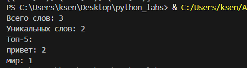

# Лабораторная работа №4

## Задание 1
```
from pathlib import Path
import csv
import os
from typing import Iterable, Sequence

def read_text(path: str | Path, encoding: str = "utf-8") -> str:                                                             
    try:
        p = Path(path) 
        return p.read_text(encoding=encoding)
    except FileNotFoundError:
        return "Такого файла не существует"
    except UnicodeDecodeError:
        return "Не удалось изменить кодировку"

def write_csv(rows: Iterable[Sequence], path: str | Path,
              header: tuple[str, ...] | None = None) -> None:                                                
    p = Path(path)
    rows = list(rows)
    with p.open("w", newline="", encoding="utf-8") as f:                                                     
        file_c = csv.writer(f)
        if header is not None and rows == []:
            file_c.writerow(('a','b'))
        if header is not None:
            file_c.writerow(header)
        if rows:
            const = len(rows[0])
            for r in rows:
                if len(r) != const:
                    raise ValueError("Все строки должны иметь одинаковую длину")
            for r in rows:
                file_c.writerow(r)

def ensure_parent_dir(path: str | Path) -> None:                                            
    p = Path(path)
    parent_dir = p.parent
    parent_dir.mkdir(parents=True, exist_ok=True) 
                                                
print(read_text(r"C:\Users\ksen\Desktop\python_labs\src\data\input.txt"))
write_csv([("world","count"),("test",3)], r"C:\Users\ksen\Desktop\python_labs\src\data\check.csv", header=None)  
```
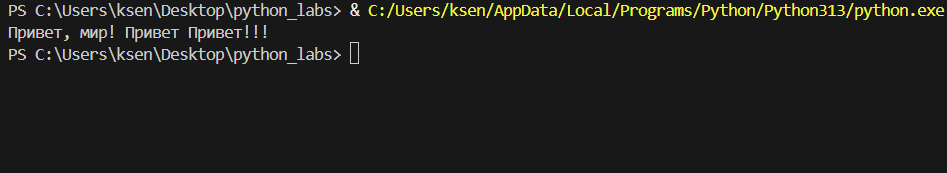
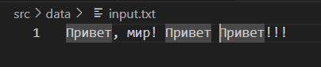
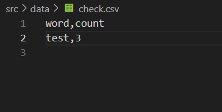

## Задание 2
```
from io_txt_csv import read_text, write_csv, ensure_parent_dir
import sys
from pathlib import Path

sys.path.append(r"C:\Users\ksen\Desktop\python_labs\src\lib")

from text import normalize, tokenize, count_freq, top_n

def exist_path(path_f: str):
    return Path(path_f).exists()

def main(file: str, encoding: str = 'utf-8'): 
    if not exist_path(file):
        raise FileNotFoundError 
    
    file_path = Path(file)
    text = read_text(file, encoding=encoding)
    norm = normalize(text) 
    tokens = tokenize(norm)
    freq_dict = count_freq(tokens)
    top = top_n(freq_dict, 5)
    top_sort = sorted(top, key=lambda x: (x[1], x[0]), reverse=True)
    report_path = file_path.parent / 'report.csv'
    write_csv(top_sort, report_path, header=('word', 'count'))  
    print(f'Всего слов: {len(tokens)}')
    print(f'Уникальных слов: {len(freq_dict)}')
    print('Топ-5:')
    for cursor in top_sort:
        print(f'{cursor[0]}: {cursor[-1]}')
main(r"C:\Users\ksen\Desktop\python_labs\src\data\input.txt")
```
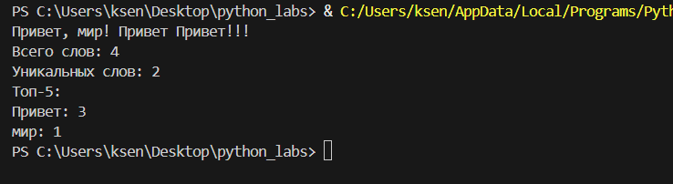

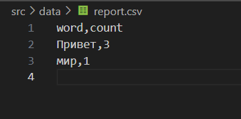

# Лабораторная работа №5

## Задание 1

```
import json
import csv
from pathlib import Path

def json_to_csv(json_path: str, csv_path: str) -> None:
    if Path(json_path).suffix != '.json' or Path(csv_path).suffix != '.csv':
        raise TypeError("Неверное расширение файла")
    with open(json_path, encoding="utf-8") as f: 
        data = json.load(f)
    if not data or not isinstance(data, list) or not all(isinstance(item, dict) for item in data):
        raise ValueError("Пустой JSON или неподдерживаемая структура")
    fieldnames = sorted({key for item in data for key in item.keys()})
    with open(csv_path, "w", newline="", encoding="utf-8") as cf:
        writer = csv.DictWriter(cf, fieldnames=fieldnames)
        writer.writeheader()
        for item in data:
            row = {field: item.get(field, '') for field in fieldnames}
            writer.writerow(row)

def csv_to_json(csv_path: str, json_path: str) -> None:
    if Path(csv_path).suffix != '.csv' or Path(json_path).suffix != '.json':
        raise TypeError("Неверное расширение файла")
    with open(csv_path, 'r', encoding='utf-8', newline='') as cf:
        reader = csv.DictReader(cf)
        lt_rows = list(reader)    
    if not lt_rows:
        raise ValueError("CSV файл пуст или содержит только заголовок")
    with open(json_path, 'w', encoding='utf-8') as jf:
        json.dump(lt_rows, jf, ensure_ascii=False, indent=2)

json_to_csv('C:/Users/ksen/Desktop/python_labs/src/data/samples/people.json', 'C:/Users/ksen/Desktop/python_labs/src/data/out/people.csv')
csv_to_json('C:/Users/ksen/Desktop/python_labs/src/data/samples/people.csv', 'C:/Users/ksen/Desktop/python_labs/src/data/out/people.json')
```
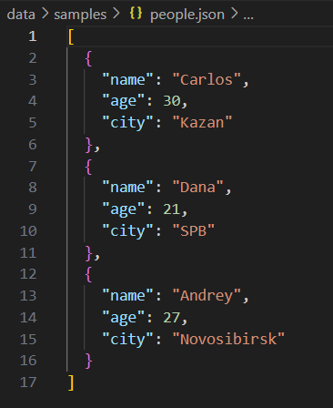
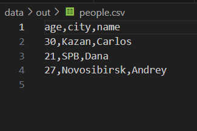
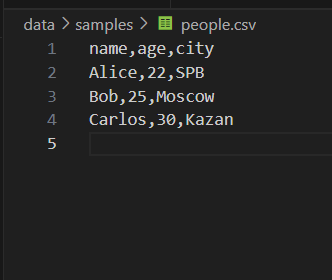
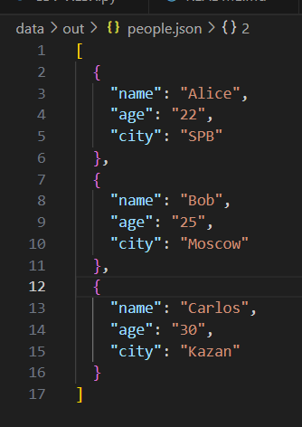

## Задание 2
```
from openpyxl import Workbook
import csv
from pathlib import Path

def csv_to_xlsx(csv_path: str, xlsx_path: str) -> None:
    if not Path(csv_path).exists():
        raise FileNotFoundError(f"CSV файл не найден: {csv_path}")  
    wb = Workbook()
    ws = wb.active
    ws.title = "Sheet1"
    try:
        with open(csv_path, encoding="utf-8") as f:
            reader = csv.reader(f)
            rows = list(reader) 
            if not rows:
                raise ValueError("CSV файл пуст")
            for row in rows:
                ws.append(row)
            for column in ws.columns:
                if column:
                    mx = max(len(str(cell.value)) for cell in column)
                    ws.column_dimensions[column[0].column_letter].width = max(mx + 2, 8)
        wb.save(xlsx_path)
    except csv.Error as e:
        raise ValueError(f"Ошибка чтения CSV: {e}")
    
csv_to_xlsx('C:/Users/ksen/Desktop/python_labs/src/data/samples/cities.csv', 'C:/Users/ksen/Desktop/python_labs/src/data/out/cities.xlsx')
csv_to_xlsx('C:/Users/ksen/Desktop/python_labs/src/data/samples/people.csv', 'C:/Users/ksen/Desktop/python_labs/src/data/out/people.xlsx')
```
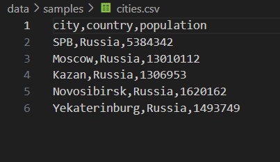
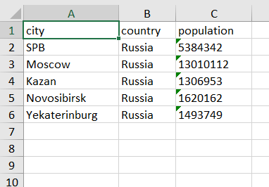

# Лабораторная работа №6

## Задание 1

```
import argparse
import sys
import os
from pathlib import Path
from src.lib.text import tokenize, count_freq, top_n

def main():
    parser = argparse.ArgumentParser(description="CLI‑утилиты лабораторной №6")
    subparsers = parser.add_subparsers(dest="command", required=True)

    cat_parser = subparsers.add_parser("cat", help="Вывести содержимое файла")
    cat_parser.add_argument("--input", required=True, help="Путь к входному файлу")
    cat_parser.add_argument("-n", "--number", action="store_true", help="Нумеровать строки")

    stats_parser = subparsers.add_parser("stats", help="Частоты слов")
    stats_parser.add_argument("--input", required=True, help="Путь к текстовому файлу")
    stats_parser.add_argument("--top", type=int, default=5, help="Количество наиболее частых слов")

    args = parser.parse_args()
    filepath = Path(args.input)

    if not filepath.exists():
        raise FileNotFoundError(f"Файл не найден: {filepath}")

    if args.command == "cat":
        """ Реализация команды cat """
        with filepath.open("r", encoding="utf-8") as f:
            for line_number, line in enumerate(f, 1):
                line = line.rstrip("\n")
                if args.number:
                    print(f"{line_number}: {line}")
                else:
                    print(line)
                    
    elif args.command == "stats":
        """ Реализация команды stats """
        with filepath.open("r", encoding="utf-8") as file:
            text = file.read()

        tokens = tokenize(text=text)
        freq = count_freq(tokens=tokens)
        top_words = top_n(freq=freq, n=args.top)
        
        print(f"Топ-{args.top} самых частых слов:")
        for word, count in top_words:
            print(f"{word} - {count}")

if __name__ == "__main__":
    main()
```
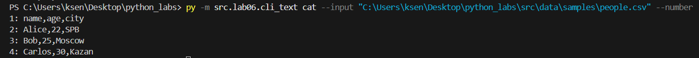
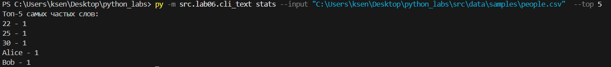

## Задание 2
```
import argparse
from pathlib import Path
from src.lab05.JSON_CSV import json_to_csv, csv_to_json
from src.lab05.CSV_XLSX import csv_to_xlsx  

def main():
    parser = argparse.ArgumentParser(description="Конвертер данных между форматами")
    subparsers = parser.add_subparsers(dest="command", help="Доступные команды конвертации")

    # JSON → CSV
    json_to_csv_parser = subparsers.add_parser("json_to_csv", help="Конвертировать JSON в CSV")
    json_to_csv_parser.add_argument("--in", dest="input", required=True, help="Входной JSON файл")
    json_to_csv_parser.add_argument("--out", dest="output", required=True, help="Выходной CSV файл")

    # CSV → JSON
    csv_to_json_parser = subparsers.add_parser("csv_to_json", help="Конвертировать CSV в JSON")
    csv_to_json_parser.add_argument("--in", dest="input", required=True, help="Входной CSV файл")
    csv_to_json_parser.add_argument("--out", dest="output", required=True, help="Выходной JSON файл")

    # CSV → XLSX
    csv_to_xlsx_parser = subparsers.add_parser("csv_to_xlsx", help="Конвертировать CSV в XLSX")
    csv_to_xlsx_parser.add_argument("--in", dest="input", required=True, help="Входной CSV файл")
    csv_to_xlsx_parser.add_argument("--out", dest="output", required=True, help="Выходной XLSX файл")

    args = parser.parse_args()

    if args.command == "json_to_csv":
        json_to_csv(json_path=args.input, csv_path=args.output)

    elif args.command == "csv_to_json":
        csv_to_json(csv_path=args.input, json_path=args.output)

    elif args.command == "csv_to_xlsx":
        csv_to_xlsx(csv_path=args.input, xlsx_path=args.output)

if __name__ == "__main__":
    main()
```
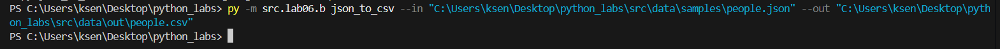
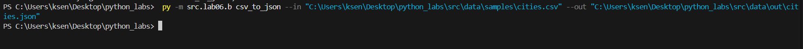

# Лабораторная работа №7

## Задание 1

```
import sys
import pytest

sys.path.append('C:/Users/ksen/Desktop/python_labs')

from src.lib.text import normalize, tokenize, count_freq, top_n

@pytest.mark.parametrize(
    "source, expected",
    [
        ("ПрИвЕт\nМИр\t", "привет мир"),
        ("ёжик, Ёлка", "ежик, елка"),
        ("Hello\r\nWorld", "hello world"),
        ("  двойные   пробелы  ", "двойные пробелы"),
        ("", ""),
        ("   ", ""),
    ],
)
def test_normalize(source, expected):
    assert normalize(source) == expected


@pytest.mark.parametrize(
    "text, expected",
    [
        ("привет мир", ["привет", "мир"]),
        ("hello world test", ["hello", "world", "test"]),
        ("", []),
        ("   ", []),
        ("знаки, препинания! тест.", ["знаки", "препинания", "тест"]),
    ],
)
def test_tokenize(text, expected):
    assert tokenize(text) == expected


def test_count_freq_basic():
    tokens = ["apple", "banana", "apple", "cherry", "banana", "apple"]
    result = count_freq(tokens)
    expected = {"apple": 3, "banana": 2, "cherry": 1}
    assert result == expected


def test_count_freq_empty():
    assert count_freq([]) == {}


def test_top_n_basic():
    freq = {"apple": 5, "banana": 3, "cherry": 7, "date": 1}
    result = top_n(freq, 2)
    expected = [("cherry", 7), ("apple", 5)]
    assert result == expected


def test_top_n_tie_breaker():
    freq = {"banana": 3, "apple": 3, "cherry": 3}
    result = top_n(freq, 3)
    expected = [("apple", 3), ("banana", 3), ("cherry", 3)]
    assert result == expected


def test_top_n_empty():
    assert top_n({}, 5) == []


def test_full_pipeline():
    text = "Привет мир! Привет всем. Мир прекрасен."
    normalized = normalize(text)
    tokens = tokenize(normalized)
    freq = count_freq(tokens)
    top_words = top_n(freq, 2)

    assert normalized == "привет мир! привет всем. мир прекрасен."
    assert tokens == [
        "привет",
        "мир",
        "привет",
        "всем",
        "мир",
        "прекрасен",
    ]
    assert freq == {"привет": 2, "мир": 2, "всем": 1, "прекрасен": 1}
    assert top_words == [("мир", 2), ("привет", 2)]
```
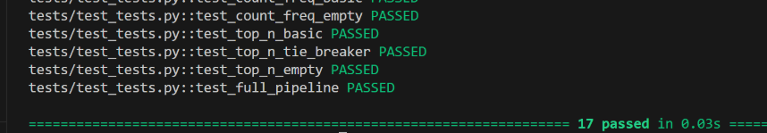

## Задание 2
```
import sys
import os

os.chdir("C:/Users/ksen/Desktop/python_labs")
sys.path.insert(0, os.getcwd())

import pytest
import csv
import json
from pathlib import Path
from src.lab05.JSON_CSV import json_to_csv, csv_to_json


def test_json_to_csv_roundtrip(tmp_path: Path):
    src = tmp_path / "people.json"
    dst = tmp_path / "people.csv"
    data = [
        {"name": "Alice", "age": 22},
        {"name": "Bob", "age": 25},
    ]
    src.write_text(json.dumps(data, ensure_ascii=False, indent=2), encoding="utf-8")
    json_to_csv(str(src), str(dst))
    with dst.open(encoding="utf-8") as f:
        rows = list(csv.DictReader(f))
    assert len(rows) == 2
    assert {"name", "age"} <= set(rows[0].keys())


def test_csv_to_json_roundtrip(tmp_path: Path):
    src = tmp_path / "people.csv"
    dst = tmp_path / "people.json"
    data = [
        {"name": "Alice", "age": "22"},
        {"name": "Bob", "age": "25"},
    ]
    with open(src, "w", newline="", encoding="utf-8") as f:
        fieldnames = list(data[0].keys())
        writer = csv.DictWriter(f, fieldnames=fieldnames)
        writer.writeheader()
        writer.writerows(data)
    csv_to_json(str(src), str(dst))
    with dst.open(encoding="utf-8") as f:
        rows = json.load(f)
    assert len(rows) == 2


@pytest.mark.parametrize(
    "function, input_file, error",
    [
        (json_to_csv, "people.json", ValueError),
    ],
)
def test_error_handling(function, input_file, error, tmp_path: Path):
    file_path = tmp_path / input_file
    file_path.write_text("Error???", encoding="utf-8")
    dst = tmp_path / "people.csv"
    f = json_to_csv if function is json_to_csv else csv_to_json
    with pytest.raises(error):
        f(str(file_path), str(dst))
```
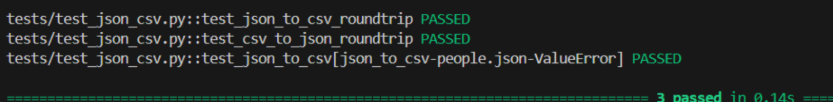

## Black
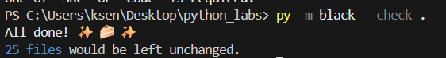

# Лабораторная работа №8

## Задание 1
```
from datetime import datetime, date
from dataclasses import dataclass
@dataclass
class Student:
    fio: str
    birthdate: str
    group: str
    gpa: float

    def __post_init__(self):
        try:
            datetime.strptime(self.birthdate, "%Y-%m-%d")
        except ValueError:
            raise ValueError(f"Неверный формат даты: {self.birthdate}. Ожидается YYYY-MM-DD")

        if not (0 <= self.gpa <= 5):
            raise ValueError(f"GPA должен быть в диапазоне 0..5, получено: {self.gpa}")

    def age(self) -> int:
        birth = datetime.strptime(self.birthdate, "%Y-%m-%d").date()
        today = date.today()
        years = today.year - birth.year
        if (today.month, today.day) < (birth.month, birth.day):
            years -= 1
        return years
    def to_dict(self) -> dict:
        return {
            "fio": self.fio,
            "birthdate": self.birthdate,
            "group": self.group,
            "gpa": self.gpa
        }

    @classmethod
    def from_dict(cls, d: dict):
        return cls(
            fio=d["fio"],
            birthdate=d["birthdate"],
            group=d["group"],
            gpa=d["gpa"]
        )

    def __str__(self):
        return f"{self.fio} ({self.group}), возраст: {self.age()}, GPA: {self.gpa}"
```
## Задание 2
```
import json
from pathlib import Path

from models import Student

DATA_DIR = Path(__file__).parent.parent
students = [
    Student(fio="Иванов Иван Иванович", birthdate="2000-05-15", group="БИВТ-1", gpa=4.5),
    Student(fio="Петрова Анна Сергеевна", birthdate="2001-03-20", group="БИВТ-2", gpa=4.8),
]
def students_to_json(students, path: str | Path) -> None:
    output_path = Path(path)
    data = [student.to_dict() for student in students]
    with output_path.open("w", encoding="utf-8") as f:
        json.dump(data, f, ensure_ascii=False, indent=2)
students_to_json(students, "src/data/lab08/students_output.json")


def students_from_json(path: str | Path):
    input_path = Path(path)
    if not input_path.exists():
        raise FileNotFoundError(f"Файл не найден: {input_path}")
    with input_path.open("r", encoding="utf-8") as f:
        data = json.load(f)
    if not isinstance(data, list):
        raise ValueError("Ожидается список студентов в JSON")
    return [Student.from_dict(item) for item in data]
students = students_from_json('src/data/lab08/students_output.json')
for student in students:
    print(student)
```
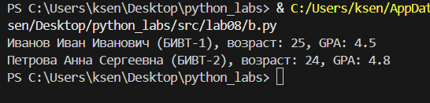
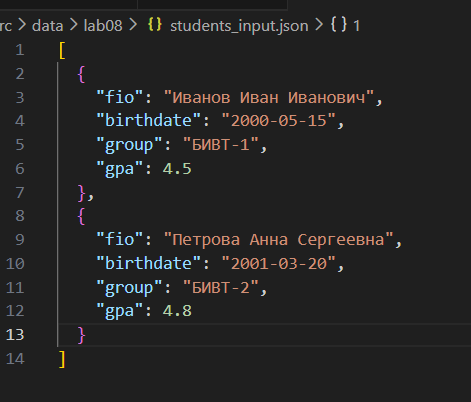
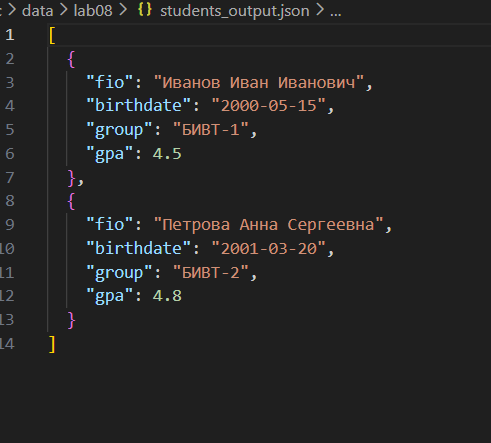

# Лабораторная работа №9

## Задание 1
```
import csv
from pathlib import Path
from typing import List, Dict, Any
import sys
import os
sys.path.append(os.path.join(os.path.dirname(__file__), '../..'))
from a import Student

class Group:
    def __init__(self, storage_path: str):
        self.path = Path("data/lab_9") / storage_path
        self._ensure_storage_exists()
    
    def _ensure_storage_exists(self):
        self.path.parent.mkdir(parents=True, exist_ok=True)
        if not self.path.exists():
            with open(self.path, 'w', encoding='utf-8', newline='') as f:
                writer = csv.DictWriter(f, fieldnames=['fio', 'birthdate', 'group', 'gpa'])
                writer.writeheader()
    
    def _read_all(self) -> List[Dict[str, Any]]:
        rows = []
        with open(self.path, 'r', encoding='utf-8') as f:
            reader = csv.DictReader(f)
            for row in reader:
                row['gpa'] = float(row['gpa'])
                rows.append(row)
        return rows
    
    def _write_all(self, rows: List[Dict[str, Any]]): 
        with open(self.path, 'w', encoding='utf-8', newline='') as f:
            writer = csv.DictWriter(f, fieldnames=['fio', 'birthdate', 'group', 'gpa'])
            writer.writeheader()
            writer.writerows(rows)
    
    def list(self) -> List[Student]: 
        rows = self._read_all()
        students = []
        for row in rows:
            try:
                student = Student.from_dict(row)
                students.append(student)
            except ValueError as e:
                print(f"Ошибка валидации студента {row['fio']}: {e}")
        return students
    
    def add(self, student: Student):
        try:
            validated_student = Student(
                fio=student.fio,
                birthdate=student.birthdate,
                group=student.group,
                gpa=student.gpa
            )
        except ValueError as e:
            raise ValueError(f"Некорректные данные студента: {e}")
        
        with open(self.path, 'a', encoding='utf-8', newline='') as f:
            writer = csv.DictWriter(f, fieldnames=['fio', 'birthdate', 'group', 'gpa'])
            writer.writerow(validated_student.to_dict())
    
    def find(self, substr: str) -> List[Student]: 
        students = self.list()
        return [student for student in students if substr.lower() in student.fio.lower()]
    
    def remove(self, fio: str): 
        rows = self._read_all()
        updated_rows = [row for row in rows if row['fio'] != fio]
        if len(updated_rows) == len(rows):
            raise ValueError(f"Студент с ФИО '{fio}' не найден")
        self._write_all(updated_rows)
    
    def update(self, fio: str, **fields):
        rows = self._read_all()
        updated = False
        for row in rows:
            if row['fio'] == fio:
                for field, value in fields.items():
                    if field in ['fio', 'birthdate', 'group', 'gpa']:
                        row[field] = value
                updated = True
                try:
                    Student.from_dict(row)
                except ValueError as e:
                    raise ValueError(f"Некорректные данные после обновления: {e}")
        if not updated:
            raise ValueError(f"Студент с ФИО '{fio}' не найден")
        self._write_all(rows)
    
    def stats(self) -> Dict[str, Any]:
        students = self.list()
        if not students:
            return {
                "count": 0,
                "min_gpa": 0,
                "max_gpa": 0,
                "avg_gpa": 0,
                "groups": {},
                "top_5_students": []
            }
        
        gpas = [student.gpa for student in students]
        groups_stats = {}
        for student in students:
            groups_stats[student.group] = groups_stats.get(student.group, 0) + 1
        sorted_students = sorted(students, key=lambda s: s.gpa, reverse=True)
        top_5 = [{"fio": s.fio, "gpa": s.gpa} for s in sorted_students[:5]]
        return {
            "count": len(students),
            "min_gpa": min(gpas),
            "max_gpa": max(gpas),
            "avg_gpa": round(sum(gpas) / len(gpas), 2),
            "groups": groups_stats,
            "top_5_students": top_5
        }
    
    def exists(self, fio: str) -> bool:
        students = self.list()
        return any(student.fio == fio for student in students)

    def is_empty(self) -> bool:
        with open(self.path, 'r', encoding='utf-8') as f:
            reader = csv.DictReader(f)
            return len(list(reader)) == 0
    
if __name__ == "__main__":

    group = Group("students.csv")

    if group.is_empty(): 
        students_to_add = [
            Student("Иванов Иван", "2000-05-15", "БИВТ-25-1", 4.5),
            Student("Иванов Петр", "2004-12-03", "БИВТ-25-2", 3.8),
            Student("Сидорова Анна", "1999-08-22", "БИВТ-25-1", 4.2),
            Student("Сидоров Алексей","2003-03-20","БИВТ-21-1",3.9),
            Student("Кузнецова Мария","2004-08-25","БИВТ-21-1",4.8),
            Student("Иванова Ольга", "2001-07-14", "БИВТ-21-1", 4.9)
        ]
        
        for student in students_to_add:
            group.add(student)
            print(f"    Добавлен: {student.fio}")
    else:
        print("Файл уже содержит данные")
    group.remove("Иванова Ольга")
    print(f"\nПосле удаления Ивановой, всего студентов: {len(group.list())}")
    print("Студенты:")
    for student in group.list():
        print(f"  {student}")
    
    print("\nПоиск по 'Иванов':")
    for student in group.find("Иванов"):
        print(f"  {student}")
    
    print("\nСтатистика:")
    stats = group.stats()
    for key, value in stats.items():
        if key == "top_5_students":
            print(f"  {key}:")
            for student in value:
                print(f"    {student['fio']} - GPA: {student['gpa']}")
        else:
            print(f"  {key}: {value}")
```
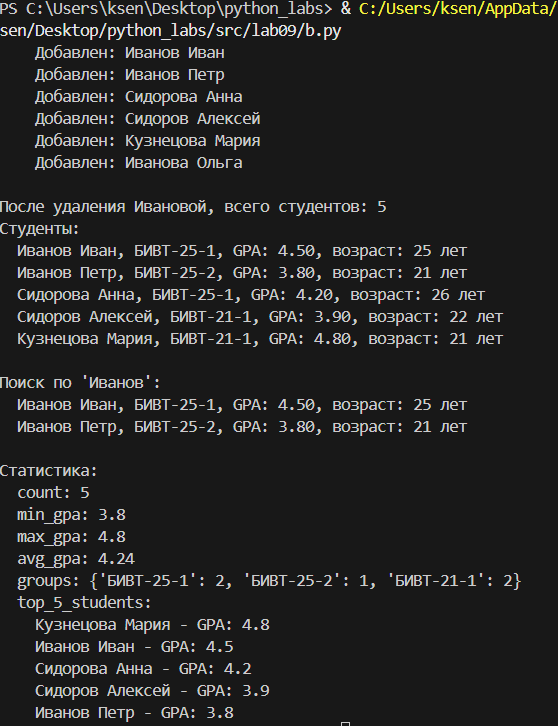